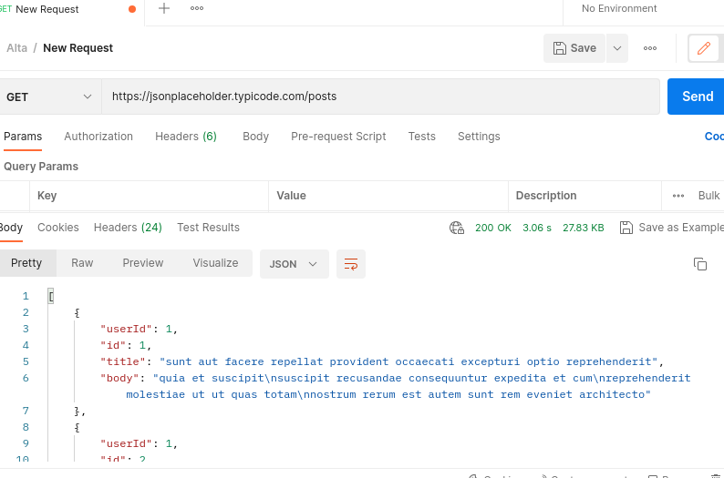
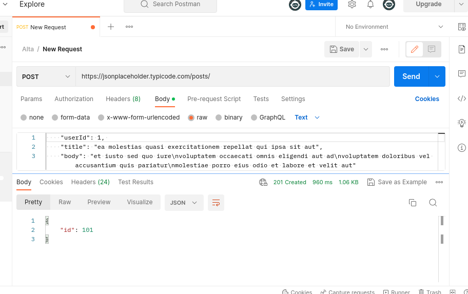
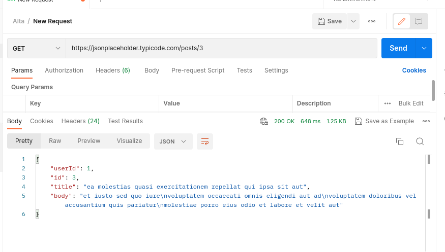
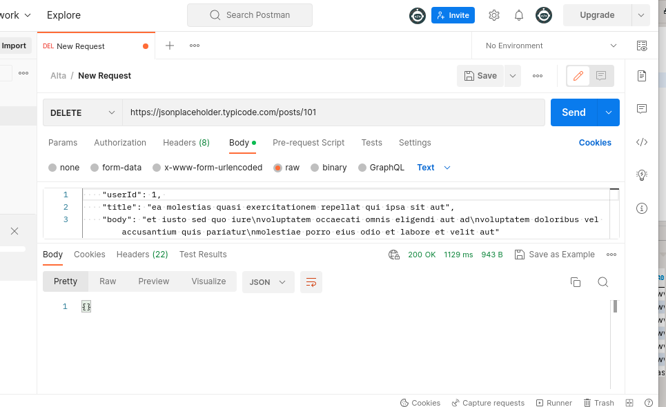
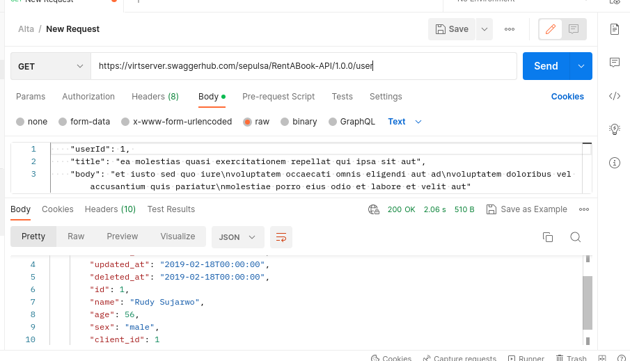
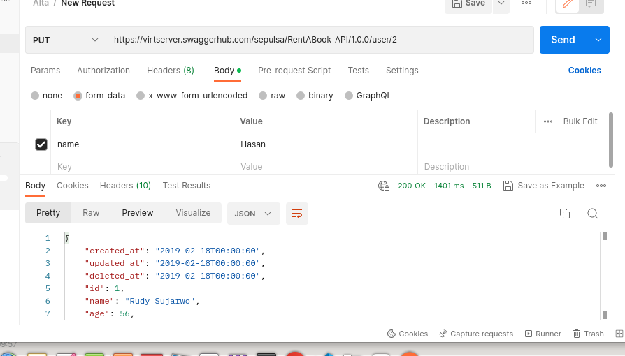
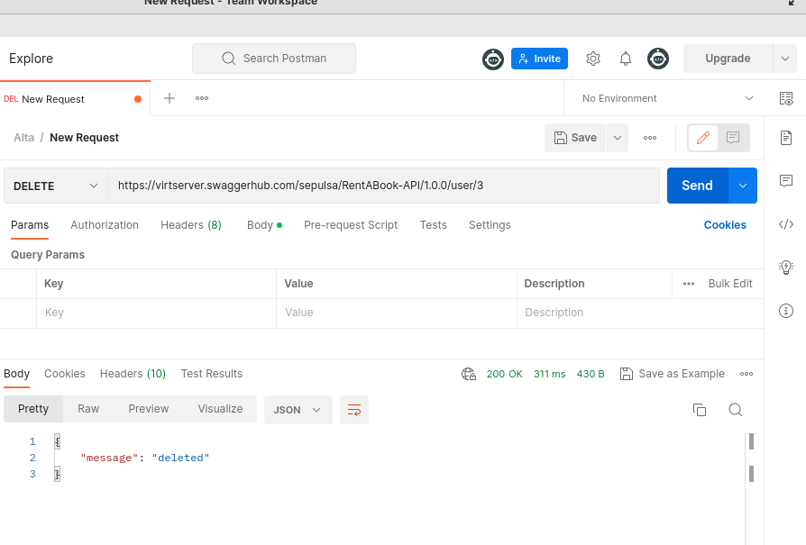
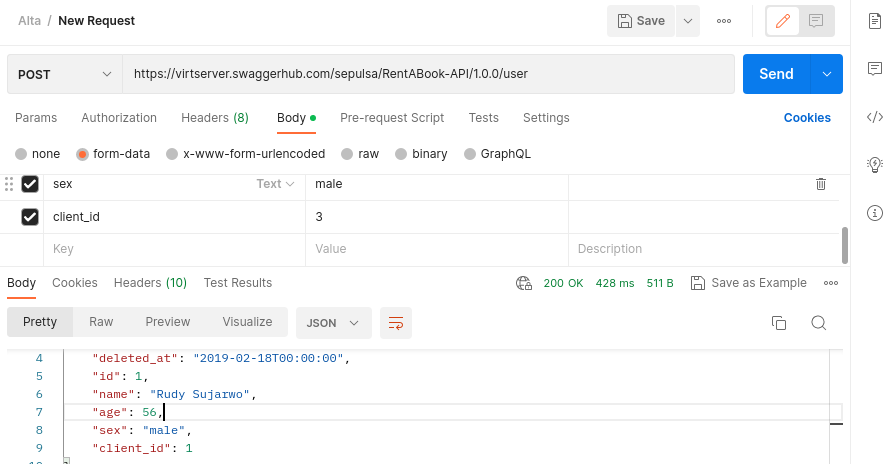

# Soal Intro RESTful API
### Skenario 1

- Tampilkan data yang diperoleh dari API : [https://jsonplaceholder.typicode.com/posts](https://jsonplaceholder.typicode.com/posts)
   
- Tampilkan data dengan id 3 yang diperoleh dari API : [https://jsonplaceholder.typicode.com/posts](https://jsonplaceholder.typicode.com/posts)
   
- Simpan data postingan ke server melalui API : [https://jsonplaceholder.typicode.com/posts](https://jsonplaceholder.typicode.com/posts)
   
- Hapus suatu data melalui API : [https://jsonplaceholder.typicode.com/posts](https://jsonplaceholder.typicode.com/posts)
   

[Referensi](https://jsonplaceholder.typicode.com/guide/)

### Skenario 2

- Lakukan request terhadap API dengan mengimplementasikan 4 Method GET, POST, PUT, DELETE.
- API Documentation (untuk referensi): [https://app.swaggerhub.com/apis-docs/sepulsa/RentABook-API/1.0.0](https://app.swaggerhub.com/apis-docs/sepulsa/RentABook-API/1.0.0)
- API Server (untuk endpoint melakukan request): [https://virtserver.swaggerhub.com/sepulsa/RentABook-API/1.0.0](https://app.swaggerhub.com/apis-docs/sepulsa/RentABook-API/1.0.0)
- GET
     
- PUT
    
- POST
    
- PUT
    
