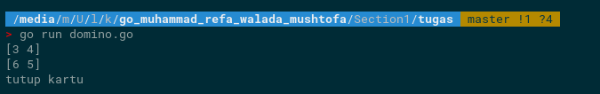

 # Praktikum Recursive, Number Theory, Sorting &  Searching

## Soal Prioritas 1 
- Dalam matematika, bilangan Fibonacci adalah barisan yang didefinisikan secara rekursif sebagai berikut:
    
    Penjelasan: barisan ini berawal dari 0 dan 1, kemudian angka berikutnya didapat dengan cara menambahkan kedua bilangan yang berurutan sebelumnya. Dengan aturan ini, maka barisan bilangan Fibonacci yang pertama adalah:
    
    0, 1, 1, 2, 3, 5, 8, 13, 21, 34, 55, 89, 144, 233, 377, 610, 987, 1597, 2584, 4181, 6765, 10946 

      ********************************Jawab :  [Sours Code](tugas/fibonaci.go)********************************   
    Outuput 
      

- Buatlah program di Golang yang dapat mengurutkan barang berdasarkan jumlah kemunculannya. Jika ada barang yang duplicate kamu hanya perlu memunculkan sekali, namun kamu perlu menampilkan total kemunculan barang tersebut!
      ********************************Jawab :  [Sours Code](tugas/jumlahkemunculan.go)********************************   
    Outuput 
      
    
- Dalam matematika, bilangan prima adalah bilangan asli yang lebih besar dari angka 1, yang faktor pembaginya adalah 1 dan bilangan itu sendiri. Angka 2 dan 3 adalah bilangan prima. Angka 4 bukan bilangan prima karena 4 bisa dibagi 2. Sepuluh deret bilangan prima yang pertama adalah 2, 3, 5, 7, 11, 13, 17, 19, 23 dan 29. Buatlah sebuah fungsi bernama getPrime yang menampilkan bilangan prima sesuai dengan deret urutannya.
  ********************************Jawab :  [Sours Code](tugas/bilanganprima.go)********************************   
    Outuput 
      

## Soal Prioritas 2 

- Buatlah program playingDomino yang menerima 2 parameter array; parameter pertama merupakan kartu domino yang ada di tangan, • Parameter kedua merupakan kartu yang sedang ada di deck. Jika ada kartu yang disarankan maka output: [x,y], jika tidak ada kartu yang sesuai maka keluarkan: 'tutup kartu'.
  ********************************Jawab :  [Sours Code](tugas/domino.go)********************************   
    Outuput 
      

## Sumary

- Recursive adalah teknik pemrograman dimana sebuah fungsi dapat memanggil dirinya sendiri secara berulang untuk menyelesaikan sebuah permasalahan.
- Number theory adalah cabang matematika yang mempelajari sifat-sifat angka dan hubungan antara angka.
- Sorting adalah proses pengurutan elemen-elemen dalam sebuah array atau struktur data berdasarkan kriteria tertentu. Selection sort adalah salah satu algoritma sorting sederhana yang bekerja dengan memilih elemen terkecil dari sisa array dan menukar posisinya dengan elemen pertama. Counting sort adalah algoritma sorting yang menghitung jumlah kemunculan setiap elemen pada array dan mengembalikan array yang terurut.
- Searching adalah proses mencari elemen dalam sebuah array atau struktur data. Linear search adalah algoritma pencarian sederhana yang mencari elemen secara berurutan dari awal array hingga elemen yang dicari ditemukan atau array habis. Builtin search adalah algoritma pencarian bawaan pada bahasa pemrograman, seperti method find pada slice di Golang yang bekerja dengan kompleksitas waktu yang lebih cepat daripada linear search.

