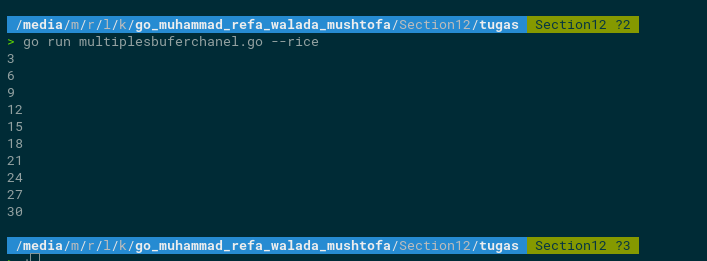

 # Soal Concurrent Programming (eksplorasi)

## Soal Prioritas 1 
1. Buatlah sebuah fungsi yang mencetak angka kelipatan x, dimana x merupakan parameter bilangan bulat positif. lalu jalankan fungsi tersebut dengan menerapkan goroutine, dengan interval waktu 3 detik! 
    ********************************Jawab :  [Sours Code](tugas/multiplex.go)********************************   
   Outuput 
     

2. Buatlah program yang mencetak bilangan kelipatan 3 dengan menerapkan goroutine dan channel!   
    ********************************Jawab :  [Sours Code](tugas/multiplechanel.go)********************************   
   Outuput 
     

3. Buatlah program yang mencetak bilangan kelipatan 3 dengan menerapkan goroutine dan buffer channel!
    ********************************Jawab :  [Sours Code](tugas/multiplesbuferchanel.go)********************************   
   Outuput 
     

4. Buatlah  program yang yang menerapkan mutex! Jenis program yang dibuat bebas (contoh: perhitungan fak
     ********************************Jawab :  [Sours Code](tugas/incrementCounter.go)********************************   
   Outuput 
     

## Soal Prioritas 2 

- Hitung frekuensi huruf dalam teks menggunakan perhitungan paralel (Bersamaan).
  ********************************Jawab :  [Sours Code](tugas/calculateFrequency.go)********************************   
    Outuput 
      

## Soal Eksplorasi (20)
1. Buatlah sebuah program yang mengambil data dari sebuah REST API dengan ketentuan sebagai berikut:
    1. Menerapkan penggunaan concurrency (goroutine, channel).
    2. Endpoint yang digunakan: [`https://fakestoreapi.com/products`](https://fakestoreapi.com/products)
    3. Contoh output dari program yang dibuat adalah sebagai berikut:
  
        
    4. Referensi tambahan yang bisa digunakan:
        1. Konversi JSON ke struct
        
        [JSON-to-Go: Convert JSON to Go instantly](https://mholt.github.io/json-to-go/)
        
          ********************************Jawab :  [Sours Code](tugas/restApi.go)********************************   
         Outuput 
           

## Sumary

### 3 Point Yang saya pelajari
1. Saya mempelajari cara apa itu Concurrent di golang
2. saya sudah terbiasa menggunakan chanel dan wg di golang
3. saya memplejari implementasi rest api di golang menggunakan goroutine

### Resume
Concurrent programming di Golang merupakan kemampuan untuk menjalankan beberapa tugas secara simultan atau paralel pada waktu yang sama. Dalam Golang, concurrent programming dapat dilakukan dengan menggunakan goroutines, channels, dan select.

Goroutines adalah lightweight threads yang dijalankan oleh Go runtime, yang memungkinkan aplikasi untuk menjalankan banyak tugas dalam waktu yang bersamaan tanpa perlu mengalami overhead yang besar seperti pada thread konvensional. Goroutines juga dapat berkomunikasi satu sama lain melalui channels, yang berfungsi sebagai media untuk mengirim dan menerima data antar goroutines.

Pada Golang, penggunaan channels sangat penting dalam melakukan concurrent programming. Channels memungkinkan pengiriman data secara aman antara goroutines yang berjalan secara simultan. Pengiriman data antar goroutines melalui channels diatur dengan menggunakan konsep select.

Dalam praktiknya, concurrent programming di Golang digunakan untuk meningkatkan kinerja dan efisiensi dari aplikasi yang dijalankan. Dalam mengimplementasikan concurrent programming di Golang, diperlukan pemahaman yang baik tentang penggunaan goroutines, channels, dan select agar dapat mengoptimalkan performa dan meminimalkan masalah deadlock atau race condition yang sering terjadi pada program yang dijalankan secara paralel.
