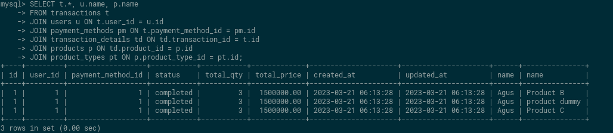

# Soal Join, Union, Agregasi, Subquery, Function - DBMS
## Data Manipulation Language (DML)
### 

1. Insert
    1. Insert 5 operators pada table operators.
       

    2. Insert 3 product type.
      
    3. Insert 2 product dengan product type id = 1, dan operators id = 3. 
      
    4. Insert 3 product dengan product type id = 2, dan operators id = 1.
       
    5. Insert 3 product dengan product type id = 3, dan operators id = 4.
      
    6. Insert product description pada setiap product.
      
    7. Insert 3 payment methods.\
      
    8. Insert 5 user pada tabel user.
      
    9.  Insert 3 transaksi di masing-masing user. (soal berlanjut ke soal 1.j)
        
    10. Insert 3 product di masing-masing transaksi.
        
2. Select
    1. Tampilkan nama user / pelanggan dengan gender Laki-laki / M.
        
    2. Tampilkan product dengan id = 3.
        
    3. Tampilkan data pelanggan yang created_at dalam range 7 hari kebelakang dan mempunyai nama mengandung kata ‘a’.
       
    4. Hitung jumlah user / pelanggan dengan status gender Perempuan.
        
    5. Tampilkan data pelanggan dengan urutan sesuai nama abjad
      
    6. Tampilkan 5 data pada data product
       
3. Update
    1. Ubah data product id 1 dengan nama ‘product dummy’.
       
    2. Update qty = 3 pada transaction detail dengan product id = 1.
       
4. Delete
    1. Delete data pada tabel product dengan id =    
    2. Delete pada pada tabel product dengan product type id 1.
      

##  Join, Union, Sub query, Function
1. Gabungkan data transaksi dari user id 1 dan user id 2.
   
2. Tampilkan jumlah harga transaksi user id 1.
  
3. Tampilkan total transaksi dengan product type 2.
  
4. Tampilkan semua field table product dan field name table product type yang saling berhubungan.
  
5. Tampilkan semua field table transaction, field name table product dan field name table user.
  
6. Buat function setelah data transaksi dihapus maka transaction detail terhapus juga dengan transaction id yang dimaksud.
7. Buat function setelah data transaksi detail dihapus maka data total_qty terupdate berdasarkan qty data transaction id yang dihapus.
8. Tampilkan data products yang tidak pernah ada di tabel transaction_details dengan sub-query.
  
  ********************************Jawab :  [SQL Code](tugas/tugas2.sql)********************************   
 

## Sumary
### 3 Point Yang saya pelajari
1. saya bisa menggunakan join di mysql
2. saya bisa menggunakan Agregasi di mysql
3. faham mengenrai relasi di mysql
### Resume
Join  
Join adalah konsep SQL yang digunakan untuk menggabungkan dua atau lebih tabel dalam satu query. Join digunakan ketika data yang dibutuhkan terdapat di dua atau lebih tabel yang berbeda. Terdapat beberapa jenis join, seperti inner join, left join, right join, dan full outer join.

Union 
Union digunakan untuk menggabungkan dua atau lebih hasil query dengan skema yang sama menjadi satu result set. Data yang dihasilkan dari union harus mempunyai jumlah kolom yang sama, tipe data yang sama dan diurutkan dalam urutan yang sama.

Agregasi 
Agregasi adalah konsep SQL yang digunakan untuk melakukan operasi matematika pada kolom tertentu dalam sebuah tabel. Beberapa fungsi agregasi yang sering digunakan adalah SUM, COUNT, AVG, MAX, dan MIN.

Subquery 
Subquery adalah konsep SQL yang digunakan untuk menjalankan query di dalam query. Subquery dapat digunakan untuk mengambil data dari satu atau beberapa tabel berdasarkan kriteria tertentu yang dihasilkan dari query yang lain.

Function 
Function adalah konsep SQL yang digunakan untuk membuat sebuah fungsi yang dapat digunakan untuk melakukan operasi pada data dalam query. Beberapa fungsi SQL yang sering digunakan adalah date, time, dan string functions. Function yang sering digunakan juga adalah stored procedure dan trigger.
