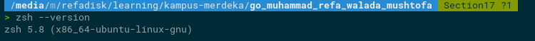
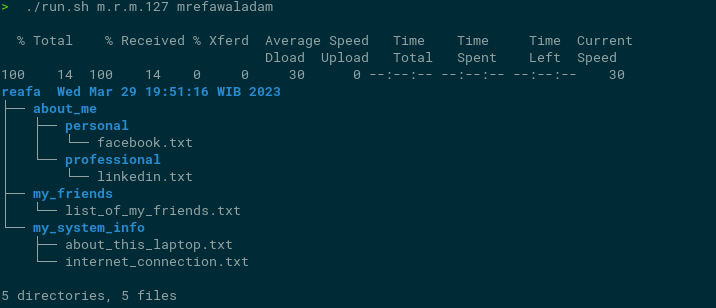

# Soal Command Line Interface (CLI)
## Soal

- Lakukan instalasi oh-my-zsh. Cara instalasi dapat dilihat disini:
    
      
 

- Membuat sebuah skrip untuk menjalankan pekerjaan secara otomatis. Rincian soal dapat dilihat disini:
   ********************************Script :  [Sours Code](tugas/run.sh)********************************   
    Outuput 
      