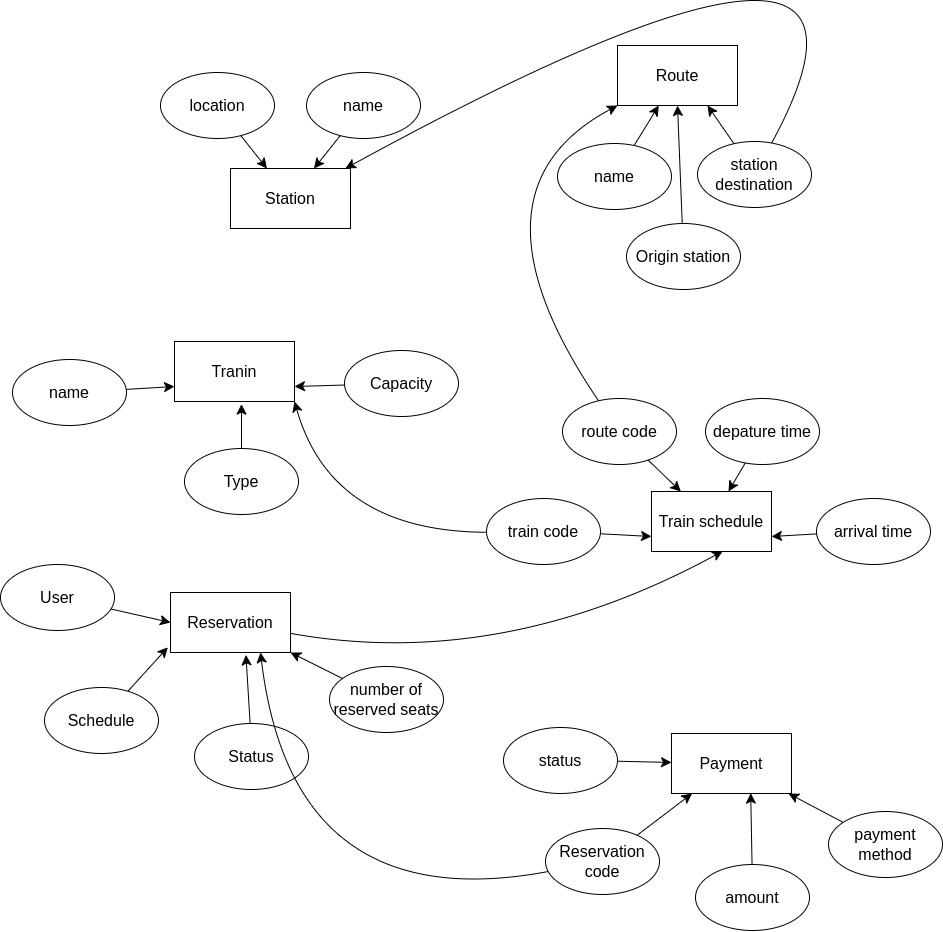
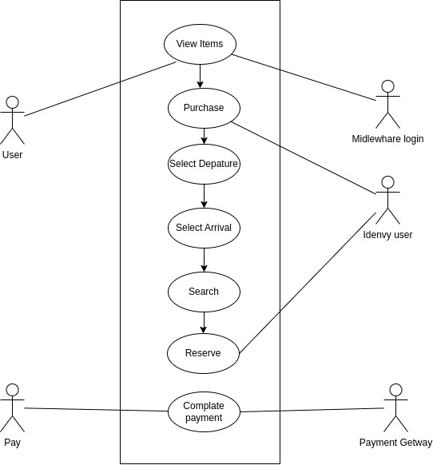

# Praktikum System Design
### Fundamental 1 (80)

- Gambarkan desain ERD dari sistem pembelian tiket kereta api!
   
- Gambarkan use case diagram dari sistem pembelian tiket kereta api!
  kayak e kurang pas sih kak yang kerjaka an ku ini soale cepet cepet =)
     

### Fundamental 2 (20)

Terdapat sebuah query pada SQL yaitu `SELECT * FROM users;`

Dengan tujuan yang sama, tuliskan dalam bentuk perintah:

1. Redis
   - Select : KEYS *
   - insert : SET user:1:name Refa  
              SET user:1:gender Male
2. Neo4j
   - Select : MATCH (u:User) RETURN u
   - insert : CREATE (:User {name: 'Refa', gender: 'Male'})
3. Cassandra
   - Select : SELECT * FROM users
   - insert : INSERT INTO users (name, gender) VALUES ('Refa', 'Male')

### Resume
sistem teknologi yang efektif dan efisien dalam memenuhi kebutuhan bisnis. Hal ini meliputi pembuatan arsitektur, perancangan database, pemilihan teknologi, pengembangan antarmuka pengguna, dan integrasi komponen sistem yang berbeda.

Dalam desain sistem, terdapat beberapa aspek yang harus dipertimbangkan, antara lain:

- Kebutuhan bisnis: Memahami kebutuhan bisnis dan menciptakan solusi teknologi yang memenuhi kebutuhan tersebut.
- Arsitektur: Membuat arsitektur sistem dengan baik, termasuk pemilihan teknologi yang tepat dan pemilihan metode komunikasi antar komponen sistem.
- Kapasitas: Menentukan kapasitas sistem, termasuk skala dan ketersediaan sistem.
- Keamanan: Memastikan sistem terlindungi dari serangan dan memiliki tindakan darurat yang sesuai dalam hal terjadi pelanggaran keamanan.
- Pengelolaan data: Memahami kebutuhan data dan memilih database yang tepat untuk sistem.
Antarmuka pengguna: Membuat antarmuka pengguna yang mudah digunakan dan menarik bagi pengguna.