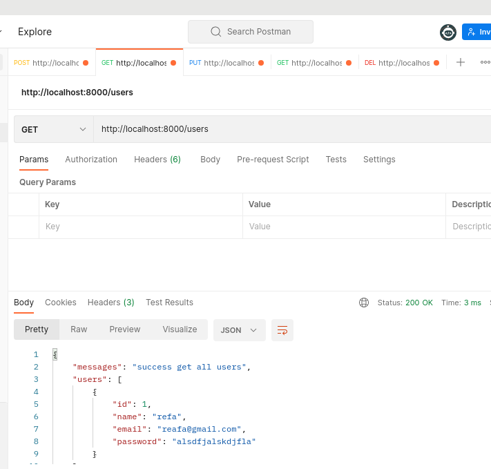
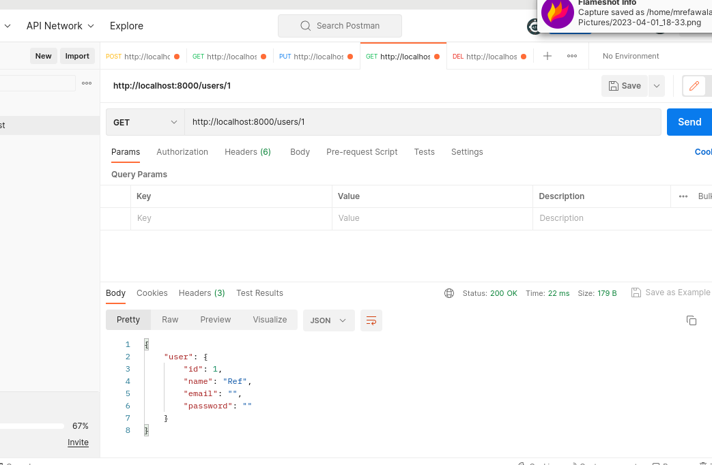
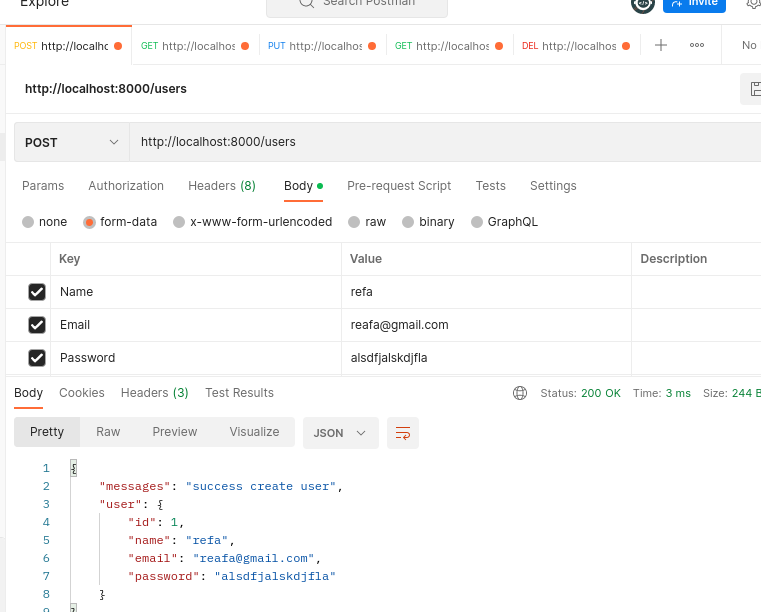
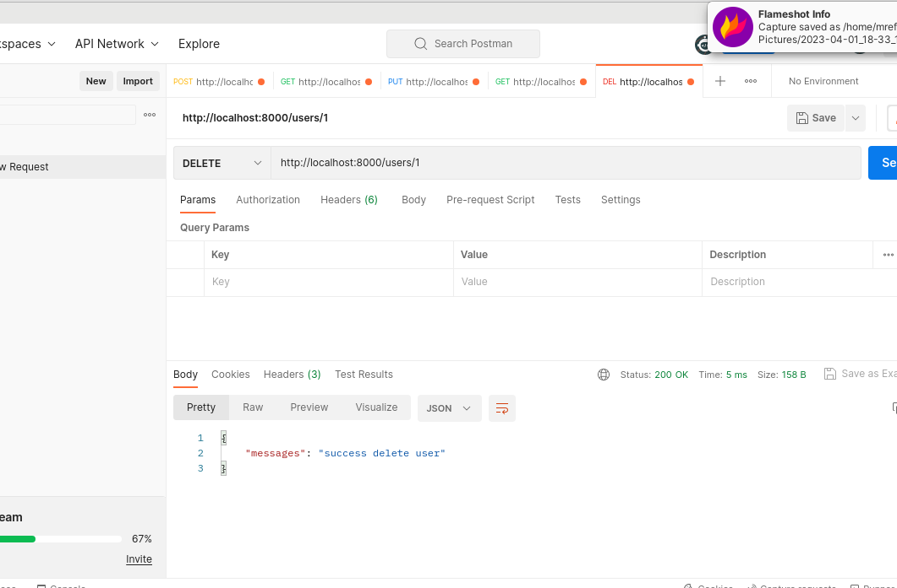

## Soal

- Buat Static API CRUD User dengan spesifikasi seperti berikut!
- Pada bagian Sample Code artinya sudah disediakan contoh code yang bisa kamu implementasikan.
- Pada bagian Need Solution Code kamu perlu membuat sendiri code-nya!
   ********************************Jawab :  [Sours Code](restapi/main.go)********************************   
 
method GET mengambil semuar user
   
 method GET by id
    
method POST buat user baru
   
Method PUT
   
Method DELETE
   