# 16 - Soal ORM & Code Structure (MVC)
## Soal Prioritas 1 (80)
1. Buat API CRUD User dengan spesifikasi  
   - Route : /users  Method : GET
     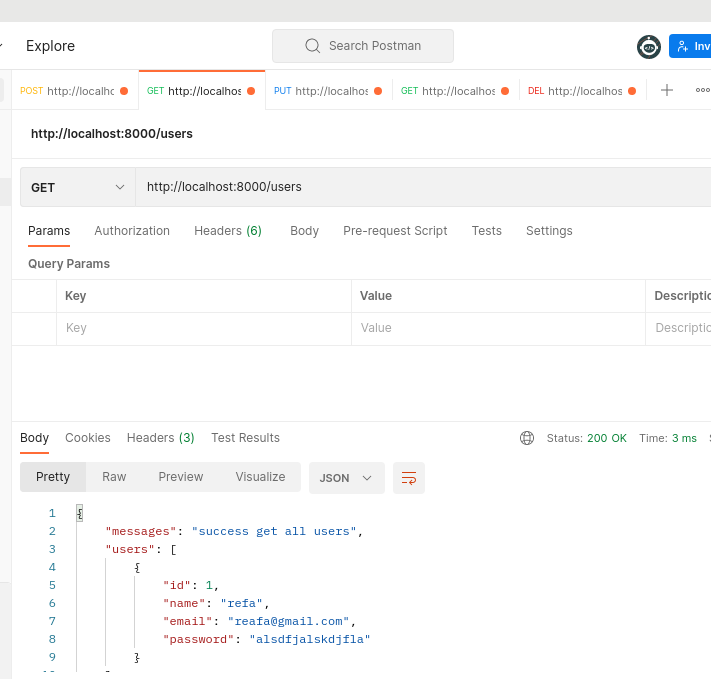 
   -  Route : /users:id  Method : GET
    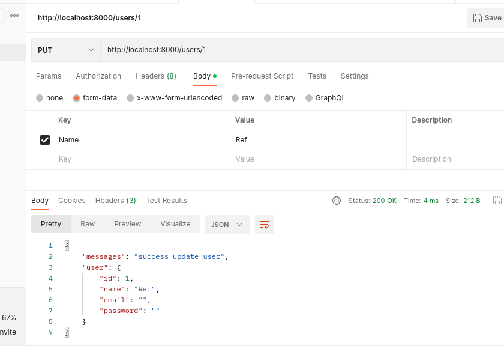 
    -  Route : /users  Method : POST (disini saya melakukan explorasi dengan melakukan encrypt password yang di kirim menggukanan bcrypt)
    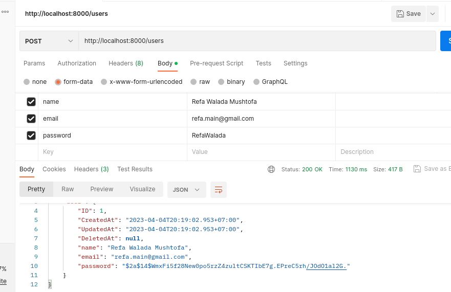 
    -  Route : /users:id  Method : PUT
        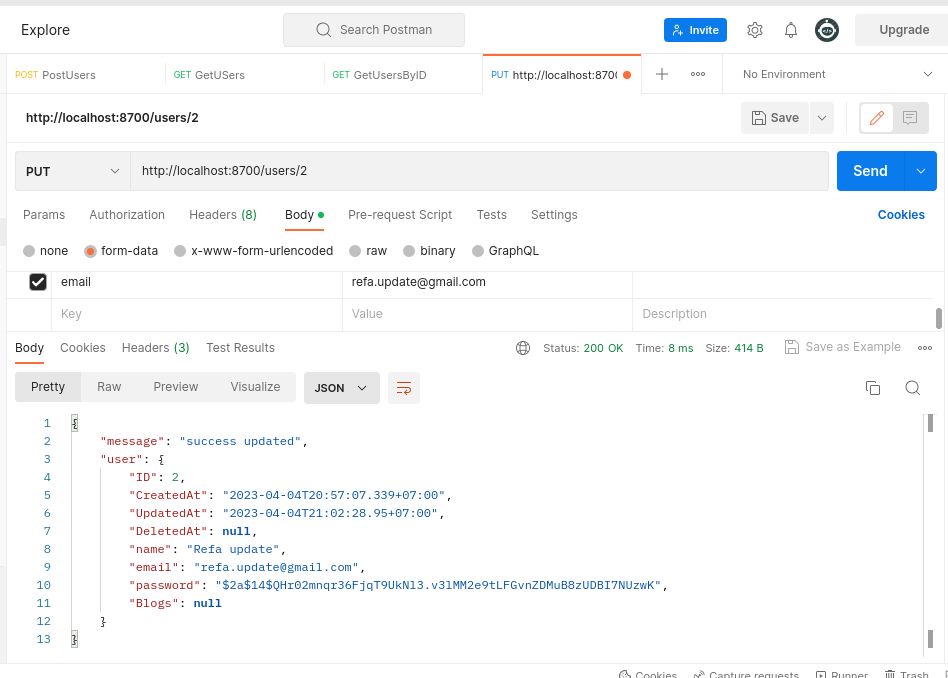 
   -  Route : /users:id  Method : DELETE
     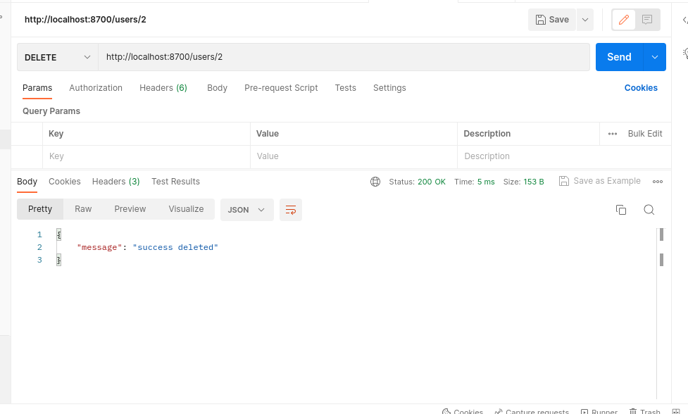 

   -  Hendling ketika menambahkan sesuatu yang tidak harus di kirim
        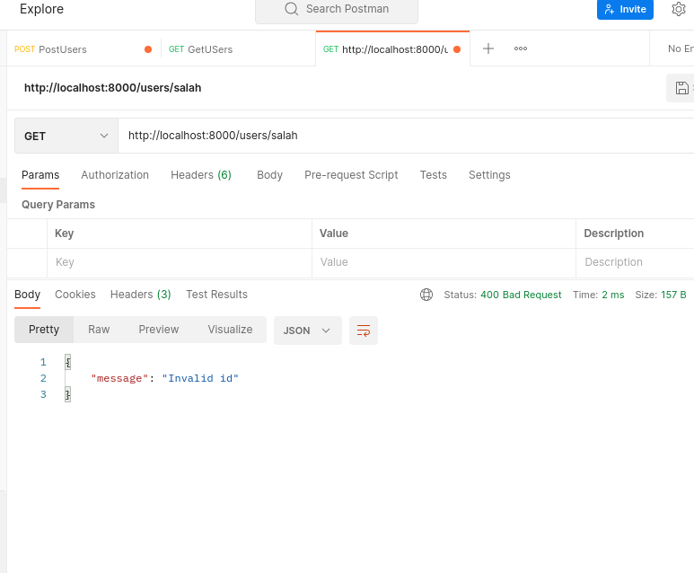 
2. Berdasarkan soal prioritas 1 yang telah dikerjakan, tambahkan fitur CRUD untuk data buku dengan spesifikasi sebagai berikut.
   - Route : /books  Method : GET
    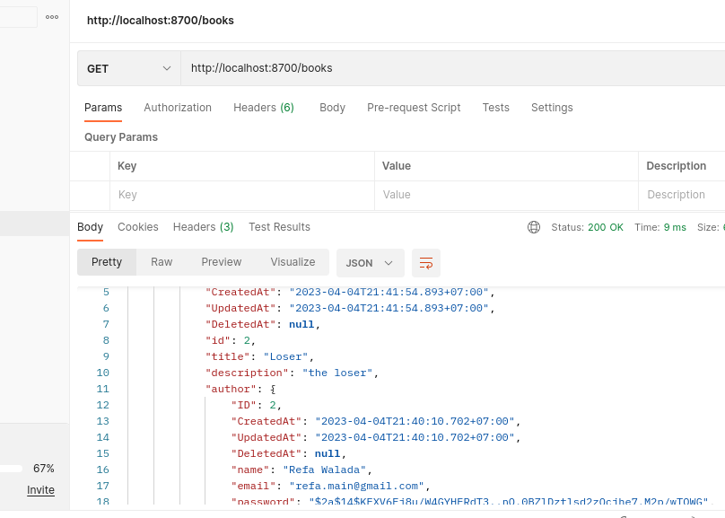 
   -  Route : /books:id  Method : GET
    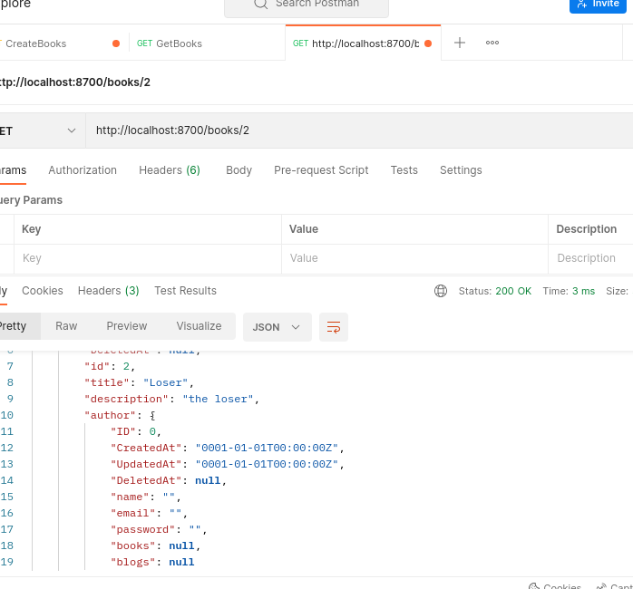 
   -  Route : /books  Method : POST 
    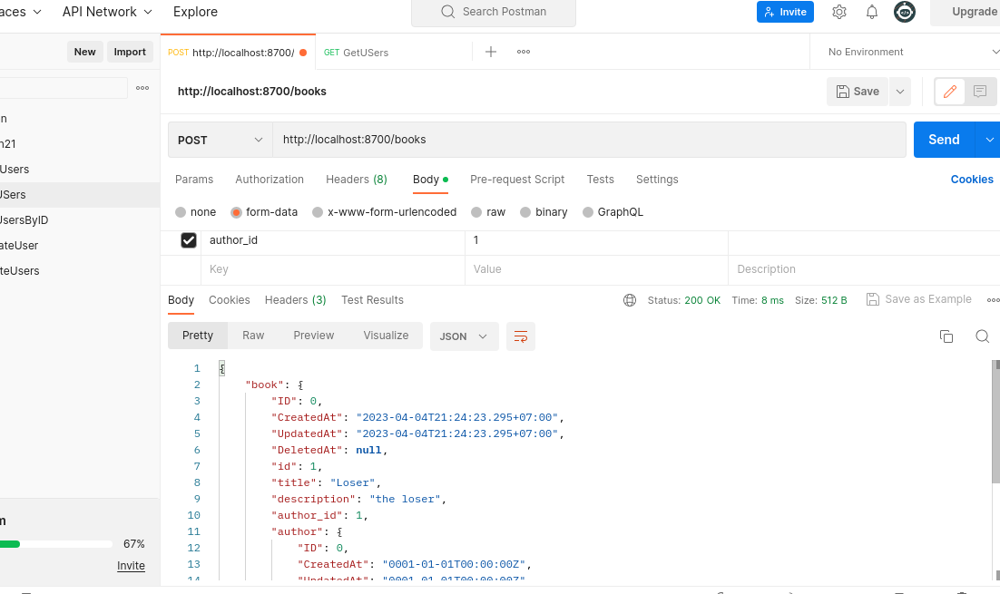 
   -  Route : /books:id  Method : PUT
     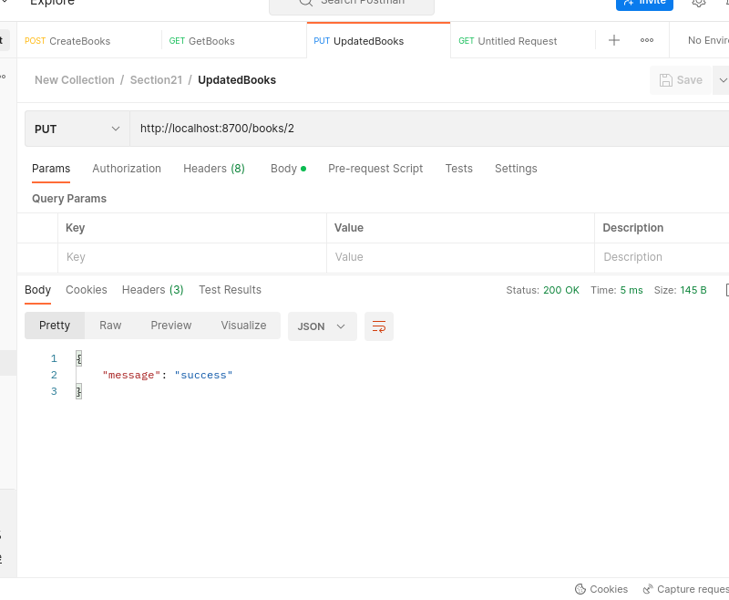 
   -  Route : /books:id  Method : DELETE
    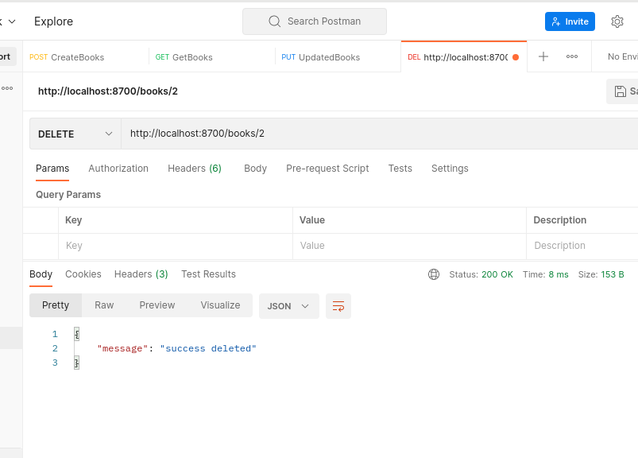 

## Resume
ketika Menggunakan ORM dan struktur MVC dapat membantu proeses developing untuk mempercepat proses pengembangan aplikasi dengan mengurangi waktu dan kompleksitas dalam membuat operasi basis data, memisahkan tanggung jawab dari setiap komponen, dan memudahkan pemeliharaan kode. di Golang sendiri menawarkan fleksibilitas dalam mengorganisasi kode dengan struktur file dan package yang dapat disesuaikan dengan kebutuhan proyek. Struktur file dan package yang baik membantu untuk memudahkan debugging dan pemeliharaan kode dan Dalam aplikasi Golang, struktur MVC umumnya diimplementasikan dengan menggunakan package yang berbeda untuk setiap komponen. Model berisi representasi data dan akses ke database, View menampilkan data untuk user, dan Controller mengatur logika bisnis dan pengolahan data. di golang sendiri mempunyai ORM (Object-Relational Mapping) adalah teknik pemetaan antara basis data relasional dan model objek. ORM memungkinkan developer untuk memanipulasi data pada basis data dengan menggunakan objek dan metode yang mudah dipahami.

3 poin yang dapat saya pelajari 
1. saya bisa menggunakan MVC di golang
2. saya bisa melakukan interaksi database di golang
3. mengentahui komudahan golang dalam membuat mvc