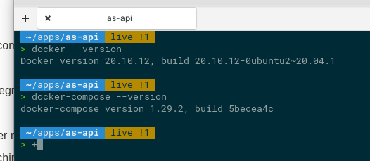
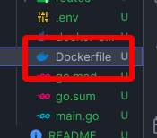
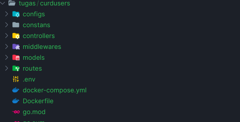
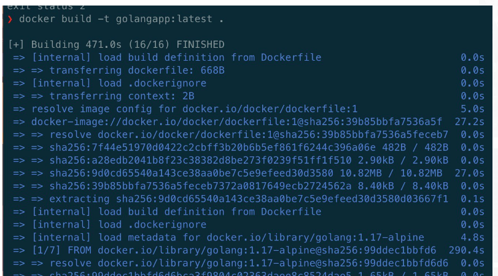
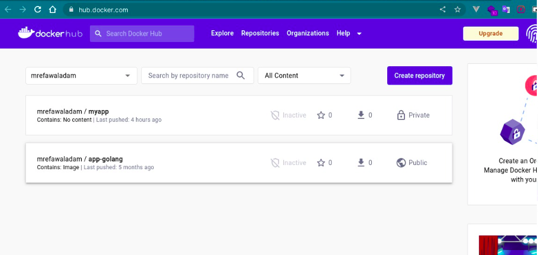
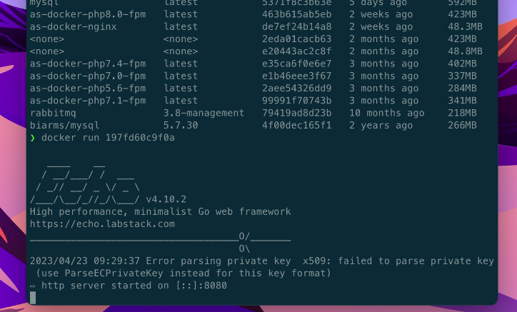

# Section 25: Docker

1. Install docker & docker compose
   
    Outuput 
      
2. Create dockerfile.
   
    Outuput 
      
3. Clone your code and integrate to your dockerfile.
 
    Outuput 
      
4. Build your container
   
    Outuput 
      
5. Push the image to docker registry
    
    Outuput 
     oy in your local machine
7. Try Docker Compose to run go app + mysql (optional)
     Outuput 
     oy in your local machine
8. Try to Deploy in the Cloud (optional)

# Sumary

ada beberapa poiny yang saya pahami salah satunya
1. Docker adalah platform open-source yang digunakan untuk membangun, mengemas, dan menjalankan aplikasi dalam kontainer yang dapat dipindahkan antar lingkungan. Kontainer memungkinkan aplikasi diisolasi dari lingkungan host dan menjamin konsistensi dan portabilitas aplikasi.
2. Docker memiliki beberapa komponen utama, seperti Docker daemon, Docker CLI, Dockerfile, dan Docker Compose. Docker daemon adalah layanan yang berjalan di latar belakang dan mengontrol semua kontainer Docker. Docker CLI adalah antarmuka baris perintah untuk mengelola kontainer Docker. Dockerfile adalah file konfigurasi yang digunakan untuk membangun Docker image. Docker Compose adalah alat yang digunakan untuk mengatur dan menjalankan aplikasi yang terdiri dari beberapa kontainer Docker.
3. Untuk mengimplementasikan Docker dengan Golang dan MySQL, pertama-tama kita perlu membuat Dockerfile untuk membangun image Docker aplikasi Golang dan kontainer MySQL. Kemudian, kita perlu menulis kode Go untuk menghubungkan aplikasi ke database MySQL dan memastikan bahwa aplikasi dapat berjalan dalam kontainer Docker dengan baik. Selanjutnya, kita dapat menggunakan Docker Compose untuk mengatur dan menjalankan aplikasi dalam lingkungan Docker.

dan 3 kesimpulan yang saya pahami adalah 
1. Dengan menggunakan Docker, saya dapat memastikan portabilitas dan konsistensi aplikasi di berbagai lingkungan.
2. Saya dapat Mengimplementasikan aplikasi dengan Docker dapat membutuhkan beberapa langkah tambahan, seperti menulis Dockerfile dan menggunakan Docker Compose. 
3. Saya melakukan Kombinasi Golang dan MySQL merupakan pilihan yang populer untuk membangun aplikasi back-end. Dalam pengimplementasiannya dengan Docker, perlu dilakukan konfigurasi khusus agar aplikasi dapat terhubung dengan database MySQL yang berjalan dalam container