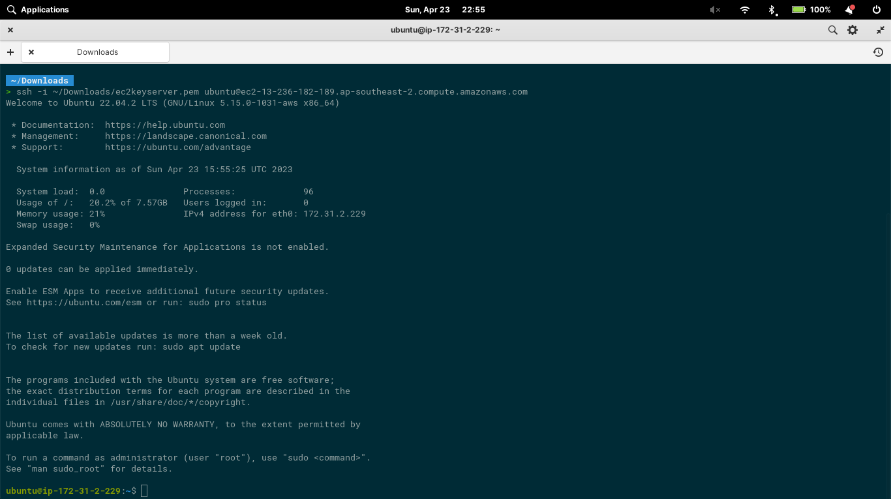

# Compute Service
## Soal
### Deployment with EC2

1. Membuat VM di EC2, dan Implementasi Security Group EC2.
     ********************************Jawab********************************  
    disini saya membuat 3 role yaitu buat port 8080 dan mysql/Auror untuk di konek kan ke RDS dan ssh untuk konek ke Open SShj
      
2. Melakukan SSH Remote ke VM di AWS EC2 (Dengan Key) serta dijelaskan key dan password.
    ********************************Jawab********************************  
   saya menggunkan key pair dengan nama ec2keyserver lalu saya memilih key pair dengan type RSA
      
    lalu di sini saya mengonekan dengan terminal loacal laptop saya dengan OPEN ssh
         
3. Deploy your Program to EC2.
   ********************************Jawab********************************  
  Disini saya berhasil menjalakna aplikasi saya dengan baik di EC2
      
### Deployment using RDS

1. Membuat DB di RDS.
     ********************************Jawab********************************  
  Saya membuat database dengan mengoneksikan mysql di loccal saya ke RDS karena RDS saya buat dengan public 
      
2. Migrate Your Local Data to RDS.
     ********************************Jawab********************************  
      
3. Connect Your Application to RDS.
 ********************************Jawab********************************  
Sudah saya buat dengan melakukan koneski mysql ke RDS lupa belum ke ss mau saya ss udah ke hapus instance saya haha
### Pointing Domain (Opsional)

1. Pointing Domain ke IP VM EC2.
       ********************************Jawab********************************  
      
2. Deploy dan jalankan aplikasi di live environment di AWS yang dapat diakses publik sesuai standar.    

       ********************************Jawab********************************  
      di sini adalah methode get menggunakan ip public dari aplikasi saya yang sudah terdeploy di local 
      

## Sumary
1. saya memmahami Amazon EC2 (Elastic Compute Cloud) adalah layanan komputasi awan yang menyediakan kapasitas komputasi yang aman dan skalabel di cloud. Anda dapat membuat dan mengelola server virtual Anda sendiri di cloud, yang disebut instances, dan dengan demikian, memiliki kontrol penuh atas lingkungan computing.

2. di Amazon RDS (Relational Database Service) adalah layanan yang menyediakan akses dan pengelolaan database relasional di cloud. Amazon RDS membuatnya mudah untuk melakukan scaling otomatis, backup otomatis, dan restore otomatis serta monitoring database yang mudah.
3. Dalam konteks pengembangan aplikasi dengan Golang, Docker dapat digunakan untuk membuat lingkungan pengembangan yang bersih, terisolasi dan terpisah yang dapat menjamin portabilitas aplikasi dan memastikan bahwa setiap pengembang dapat menjalankan aplikasi dengan lingkungan yang sama. Hal ini akan meminimalkan masalah yang muncul di lingkungan pengembangan yang berbeda-beda.
4. Dalam implementasi Golang dan MySQL di AWS EC2, saya harus terlebih dahulu menginstal dan mengkonfigurasi Golang dan MySQL di dalam instance. Setelah itu, saya dapat menggunakan Docker untuk membuat container dan menjalankan aplikasi Golang di dalam container tersebut dengan koneksi ke database MySQL yang berada di instance EC2.

3 kesimpulan yang dapat diambil dari pembelajaran ini adalah:

1. AWS EC2 dan RDS memberikan solusi yang sangat baik untuk menangani kebutuhan komputasi dan database pada skala besar dan kecil. Mereka menyediakan infrastruktur awan yang dapat diandalkan, scalable, dan terkelola dengan baik.

2. Dalam konteks pengembangan aplikasi, Docker dapat mempermudah deployment dan menjaga portabilitas aplikasi dalam lingkungan pengembangan yang berbeda-beda.
3. AWS EC2 dan Golang dapat digunakan bersama-sama untuk mengembangkan aplikasi yang terisolasi dan bersih di lingkungan awan, dengan kemampuan scaling otomatis yang sangat baik.