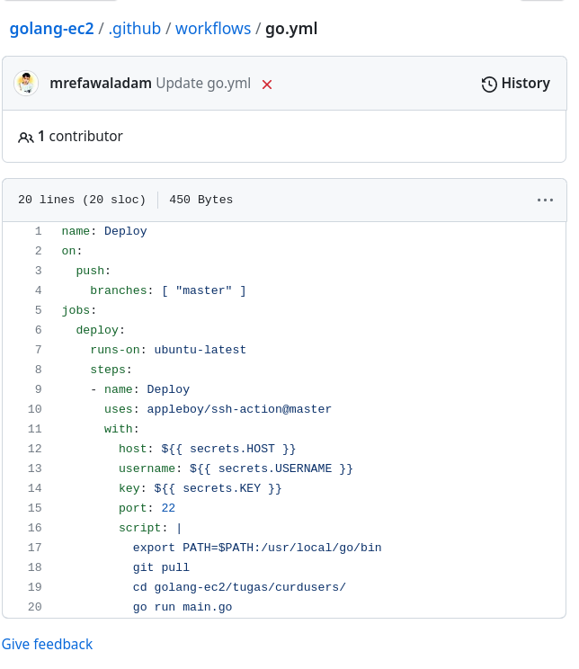

# Section 28

Repository : https://github.com/mrefawaladam/golang-ec2
Screenshot :
Note Sory kak cepat cepat soale keburu dl 
berikut adalah piline simpel yans saya buat 
   
 berikut adalah proses deploy 

# Sumary 

 
CI/CD (Continuous Integration/Continuous Delivery) adalah proses otomatisasi pengembangan perangkat lunak yang melibatkan pengujian, integrasi, dan pengiriman kode secara berkesinambungan dan terus-menerus.

Golang merupakan bahasa pemrograman yang didesain untuk memudahkan pengembangan aplikasi yang bersifat scalable, reliable, dan efficient. AWS (Amazon Web Services) menyediakan beberapa layanan untuk mendukung pengembangan dan deployment aplikasi Golang.
1. Menggunakan Git sebagai version control system untuk menyimpan dan mengelola kode aplikasi.
2. Membuat unit test dan integration test pada kode aplikasi Golang menggunakan library seperti testing dan testify
3. Memastikan aplikasi Golang dapat berjalan pada lingkungan produksi dengan baik dengan melakukan pengujian dan pemantauan kinerja aplikasi secara berkala.

Dalam pengembangan aplikasi Golang di AWS, Docker juga dapat digunakan sebagai tool untuk memudahkan deployment aplikasi. Dalam hal ini, Docker dapat membantu dalam pembuatan image aplikasi yang dapat di-deploy ke berbagai lingkungan dengan mudah dan cepat.

Namun, jika saya belum menggunakan Docker, masih ada cara untuk melakukan CI/CD pada aplikasi Golang di AWS tanpa menggunakan Docker. saya tetap dapat menggunakan layanan AWS yang disebutkan di atas untuk melakukan otomatisasi pengembangan dan deployment aplikasi Golang ke server produksi.

Demikianlah ringkasan tentang CI/CD dengan Golang di AWS. Semoga bermanfaat bagi saya!