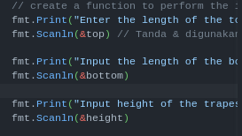

# Section 4: Introduction to Algorithm and Algorithm in Golang
## Praktikum Algoritma
### Soal
- buatlah sebuah flowchart untuk menentukan bilangan prima : [Jawaban](praktikum_alogrithm/bilangan_prima.png)
- buatlah sebuah flowchart untuk menentukan bilangan kelipatan 7 : [Jawaban](praktikum_alogrithm/flowchar_trapesium.png)
- buatlah sebuah flowchart untuk menghitung luas trapesium : [Jawaban](praktikum_alogrithm/kelipatan_bilangan7.png)
### Review
di sola praktikum algorithms dalam pembuatan flowchart tadi saya akan melakukan review di sini saya belajar bagaiaman caranya membuat flowchart dengan baik dan ada beberapa studi kasus yang saya kerjakan yang menurut saya paling efort adalah di soal menentukan bilangan prima karena saya membuat flowchart tersebut dengan input output dan kondisi yang banyak

## Praktikum Basic Programming
### Soal Prioritas 1
- buatlah sebuah program untuk menghitung luas trapesium  [Jawaban](praktikum_basic_prgoramming/luas_trapesium.go) 
 *Review*
disini saya  membuat file dengan nama luas_trapesium.go saya membuat 3 variabel dengan tipe float32 di sini saya menambahkan proses untuk Input dengan fmt     dan membuat fungsi untuk mencar luas dari segitiga tersebut

