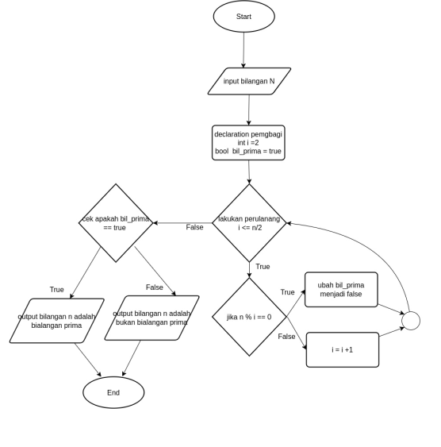

# Section 4: Introduction to Algorithm and Algorithm in Golang
## Praktikum Algoritma
### Soal
- buatlah sebuah flowchart untuk menentukan bilangan prima : [Jawaban](praktikum_alogrithm/bilangan_prima.png)
- buatlah sebuah flowchart untuk menentukan bilangan kelipatan 7 :[Jawaban](flowchar_trapesium.png)
- buatlah sebuah flowchart untuk menghitung luas trapesium :[Jawaban](kelipatan_bilangan7.png)

