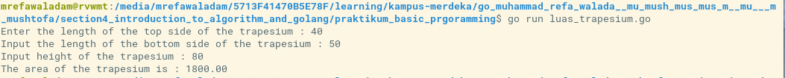
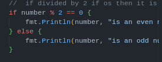
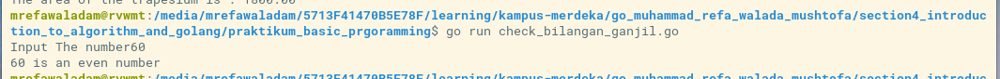
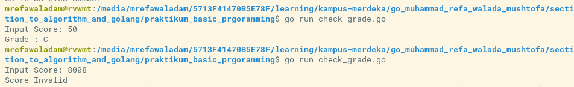
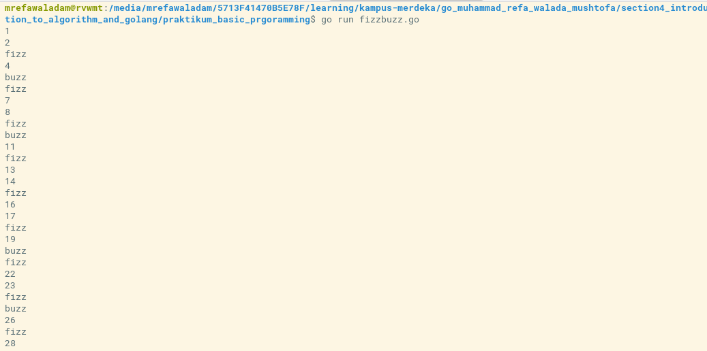
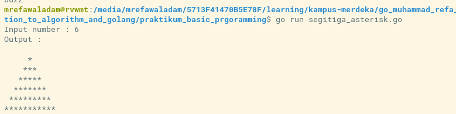
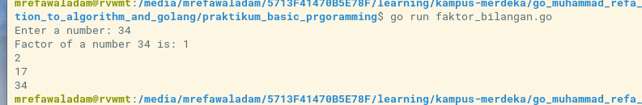

# Section 4: Introduction to Algorithm and Algorithm in Golang
## Praktikum Algoritma
### Soal
- buatlah sebuah flowchart untuk menentukan bilangan prima : [Jawaban](praktikum_alogrithm/bilangan_prima.png)
- buatlah sebuah flowchart untuk menentukan bilangan kelipatan 7 : [Jawaban](praktikum_alogrithm/flowchar_trapesium.png)
- buatlah sebuah flowchart untuk menghitung luas trapesium : [Jawaban](praktikum_alogrithm/kelipatan_bilangan7.png)
### Review
di soal praktikum algorithms dalam pembuatan flowchart tadi saya akan melakukan review di sini saya belajar bagaiaman caranya membuat flowchart dengan baik dan ada beberapa studi kasus yang saya kerjakan yang menurut saya paling efort adalah di soal menentukan bilangan prima karena saya membuat flowchart tersebut dengan input output dan kondisi yang banyak

## Praktikum Basic Programming
### Soal Prioritas 1
- buatlah sebuah program untuk menghitung luas trapesium  [Jawaban](praktikum_basic_prgoramming/luas_trapesium.go) 
  *Review* 
disini saya  membuat file dengan nama luas_trapesium.go saya membuat 3 variabel dengan tipe float32 di sini saya menambahkan proses untuk Input dengan fmt     dan membuat fungsi untuk mencar luas dari segitiga tersebut
 *Output* 

- buatlah sebuah program untuk menentukan apakah sebuah bilang adalah bilang ganjil atau genap  [Jawaban](praktikum_basic_prgoramming/check_bilangan_ganjil.go) 
  *Review* 
 di sini saya membuat system bisa melakukan input number point pentig di soal ini adalah saya melakukan proses pencarrian ganjil genap menggunakan kondisi jika number bisa di mod = 0 maka bilanang itu genap dan sebalikanya jika bilangan itu tidak bisa di mod = 0 maka bilanang itu ganjil    
 
 *Output* 

- buatlah sebuah program untuk menentukan grade dari sebuah nilai, dengan ketentuan sebagai berikut:
    - Nilai 80 - 100: A
    - Nilai 65 - 79: B
    - Nilai 50 - 64: C
    - Nilai 35 - 49: D
    - Nilai 0 - 34: E
    - Nilai kurang dari 0 atau lebih dari 100 maka tampilkan 'Nilai Invalid' [Jawaban](praktikum_basic_prgoramming/check_grade.go) 
 *Review* 
saya menggunakan switch case untuk melakuka proses pencarian nilai dengan kondisi yang di tetnukan alasan saya sendiri memilih swich case karena membuatuhkan condisi yang banyak
  

 *Output* 

- buatlah sebuah program yang mencetak angka dari 1 sampai 100 dan untuk kelipatan '3' cetak "Fizz" sebagai ganti angka, dan untuk kelipatan '5' cetak "Buzz”. Sebagai contoh; 1 2 fizz 4 buzz fizz 7 8 fizz buzz [Jawaban](praktikum_basic_prgoramming/fizzbuzz.go) 
  *Review* 
 di studi kasus ini saya langun saja membuat fungsi untuk perulangan dan menambahkan switch case untuk hendling jika bilangan habis di mod 3 atau mod 5
  *Output* 

## Soal Prioritas 2  
- Buatlah sebuah program untuk mencetak segitiga asterik seperti dibawah ini! [Jawaban](praktikum_basic_prgoramming/segitiga_asterisk.go)
  *Output* 

- Buatlah sebuah program untuk mencetak faktor bilangan dari sebuah angka, seperti dibawah ini! [Jawaban](praktikum_basic_prgoramming/faktor_bilangan.go)
 *Output* 

