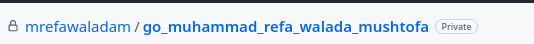
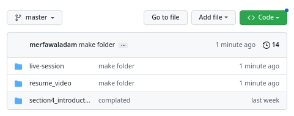
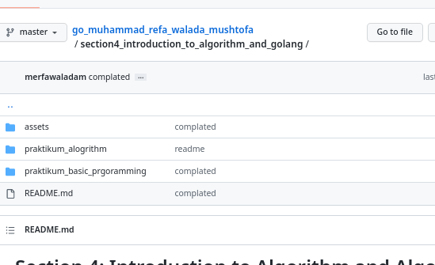
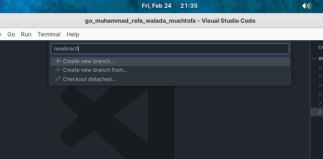
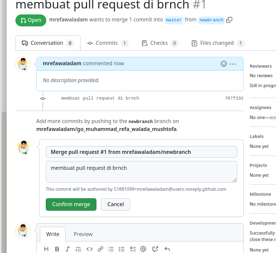
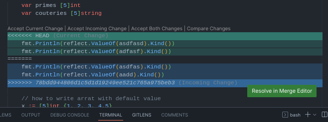
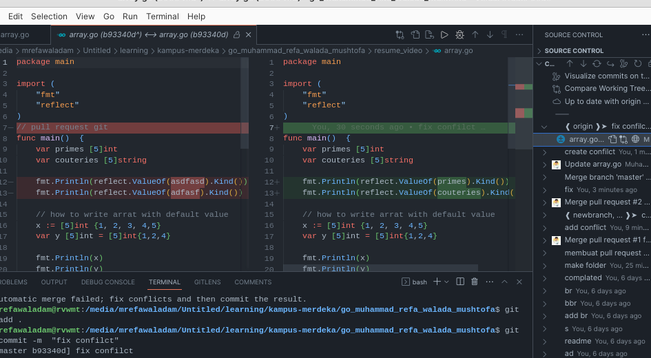

# Section 6: Memahami Penggunaan Version Control yaitu Git dan Github
## Soal Prioritas 1 (80) 
- buatlah sebuah repository github yang sesuai dengan namaKelas_namaKalian. contohnya   
   *Jawab* 
  di sini saya membuat reporsitory saya menggunakan gitub dendan repository seperti di bawah ini   
- buatlah folder yang berurutan dan diberi nama sesuai dengan nama soal yang kalian kerjakan. contoh penamaan
    - 1_Soal_GIthub
    - 2_Soal Software_Testing_Fundamental
    - 3_Soal_Testing_Documentation
    - seterusnya sesuai dengan nama soal yang kalian kerjakan. buat folder tersebut sampai soal rest API.
     *Jawab* 
    di sini saya membuat folder di repo si tori saya tapi saya tidak membuat sampai dengan soal rest API. karena folder kosong tidak bisa di push 
      
    - pada setiap folder akan berisikan sub folder lagi seperti berikut
      
## Soal Prioritas 2 (20)
- Buatlah branch baru pada github yang kalian buat
     *Jawab* 
    di sini saya membuat branch baru dengan nama branch newbrach saya membuat menggunakan vs code untuk tampilanya seperti ini 
      
- Lakukan Pull Request pada branch tersebut sehingga akan menambah hal baru pada branch main/master terdapat foto terkait Pull Request *Jawab*  di sini saya menggabungkan branch yang baru saya buat tadi saya menggabungkan dengan branch master untuk contohnya seperti berikut ini   
## Soal Explorasi (20)
- dengan project terserah kalian, praktikkan salah satu workflow serderhana dan buktikan dengan Screenshoot. github flow/gitflow/trunkbase
    - akan ada foto terkait flow yang disebutkan
- lakukan management konflik pada github
   *Jawab*  di sini saya membuat konflik dari brach yang saya pull dari github saya untuk case nya seperti ini 
    
- Lakukan code review pada github yang kalian kumpulkan
    - terdapat foto seperti apa itu code review
    *Jawab*  di sini saya membuat code review dari proses pull request untuk merge branch dari github saya  untuk bukti nya seperti berikut ini 
     

## review 
di sini saya mempelajari proses membuat repository dengan git saya memplejari proses management confilct dan saya bisa menermrapakan  Trunk-Based Development di github 