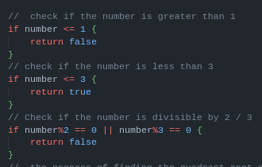
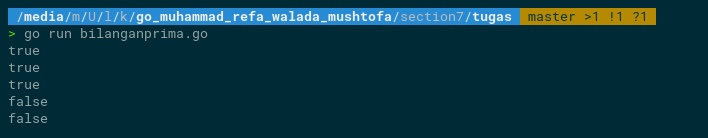
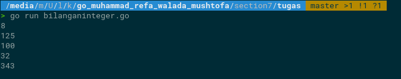

# Soal Time and Space Complexity (eksplorasi)

## Tugas
 1. alam matematika, bilangan prima adalah bilangan asli yang lebih besar dari angka 1, yang faktor pembaginya adalah 1 dan bilangan itu sendiri. 2 dan 3 adalah bilangan prima. 4 bukan bilangan prima karena 4 bisa dibagi 2. Kamu diminta untuk membuat fungsi untuk menentukan bahwa sebuah bilangan termasuk bilangan prima atau tidak.
    
    Buatlah solusi yang lebih optimal, dengan kompleksitas lebih cepat dari O(n) / O(n/2).
    
    ********************************Sample Test Case********************************
    
    Input: 1000000007
    
    Output: Bilangan Prima
    
    Input: 1500450271
    
    Output: Bilangan Prima
      ********************************Jawab********************************  
    disini saya mengoptimlakan dengan menggunakan compelxity  O(sqrt(n)) karena lebih cepat dari dari O(n) atau O(n/2) untuk impelementasi nya seperti code berikut ini : [Sours Code](tugas/bilanganprima.go) di situ saya membuat fungsi untuk proses  plementasi nya yaitu dengan melakukan proses pengecekan bilangan prima ada beberapa hendling untuk proses pencarian nya yaitu menggunakan sebaga berikut    
    lalu saya membuat looping lagi  mengecek Proses menemukan akar kuadran dari  number  dengan pengecekan apakah dapat dibagi dengan I / atau I % 2 untuk mengetahui bilangan prima untuk kode nya seperti berikut ini 
    [Sours Code](tugas/bilanganprima.go#L22)
 untuk output nya sebagai berikut ini 
      
2. Terdapat dua bilangan integer yaitu x dan n. Buatlah sebuah fungsi untuk melakukan perhitungan perpangkatan (x^n dibaca x pangkat n). Time complexity dari sebuah fungsi perpangkatan harus lebih cepat dari O(n). Contoh time complexity yang optimal adalah logaritmik.
     ********************************Jawab********************************  
    di case ini saya menggunakan  complexity logaritmik karena lebih memudahkan saya dalam penulisan kode tapi menurut sya ini masih belum efektif karena masih memakan waktu jika data lebih banyak 
    [Sours Code](tugas/bilanganinteger.go) untuk output nya sebagai berikut ini 
      

## Resume
di sini saya mempunyai kesimpulan Space complexity pada Golang mengacu pada jumlah memori yang digunakan oleh program ketika dieksekusi. Hal ini tergantung pada banyak faktor, seperti jumlah variabel, tipe data, penggunaan array atau slice, dan alokasi memori secara dinamis. Oleh karena itu, sangat penting untuk mempertimbangkan space complexity saat menulis program Golang untuk memastikan penggunaan memori yang optimal.