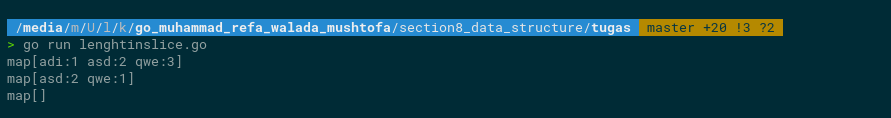

# Soal Data Structure (Array, Slice, Map), Function

## Soal Prioritas 1 (80)
- Buatlah sebuah program menggabungkan 2 array yang diberikan, dan jangan sampai terdapat nama yang sama di data yang sudah tergabung tadi!
  ********************************Jawab********************************  
 saya akan menjelaskan apa yang saya buat di sini saya membuat fungsi dengan melakukan combine terhadap ke dua  array yang dikirim dan lalu saya juga membuat keyElement yang bertujuan untuk tempat element darti array yang di tampung lalu saya menggunakan looping untuk mencari element yang duplikat lalu membuat kondisi untuk mengecek element dari varable keyElement jika ada yang kososng maka di tambahkan untuk jawaban saya adalah berrikut ini : [Sours Code](tugas/mergearray.go)  
    
- buatlah sebuah program yang dapat menghitung berapa banyak sebuah string yang sama didalam sebuah slice!
  ********************************Jawab********************************  
 di sini saya membuat fungsi mapping dengan membuat tambahan baris code dengan saya membuat variabel result untuk menyimpan mapping dari slace lalu saya manambahkan looping dengan menetapkan key dari variable resul lalu jika ada element yang lebih dari 1 melakukan iterasi untuk jawaban saya sebagai berikut ini : [Sours Code](tugas/lenghtinslice.go) untuk outpu dari program yang saya buat sebagai berikut   
 
- Buat program sesuai dengan deskripsi di bawah. Input merupakan variable string berisi kumpulan angka. Output merupakan list / array berisi angka yang hanya muncul 1 kali pada input.
    ********************************Jawab********************************  
di fungsi munculSekali saya membuat hendling dengan variabel lntAngka yang bertipe rune saya guanakan untuk mendatkan memetakan karakter unicode. lalu saya mambuat fungsi untuk mengkalkulasi angka yang dikirim ke lntAngka dan di buat iterasi untuk mendapatkan key nya 
lalu saya membuat looping dari angka yang dikirm tadi dan melakukan pengecekan dengan mengecek apakah key yang di looping tadi == 1 jika iya maka akan di gabungkan ke variable result
untuk sorucodenya sebegai berikut : [Sours Code](tugas/stringtonumber.go) untuk output nya sebagai berikut ini   

## Soal Eksplorasi (20)
- Diberi matriks persegi, buatlah program untuk menghitung selisih absolut antara jumlah diagonalnya
   ********************************Jawab********************************  
  [Sours Code](tugas/diagonalmatriks.go) 
  Outuput 
    